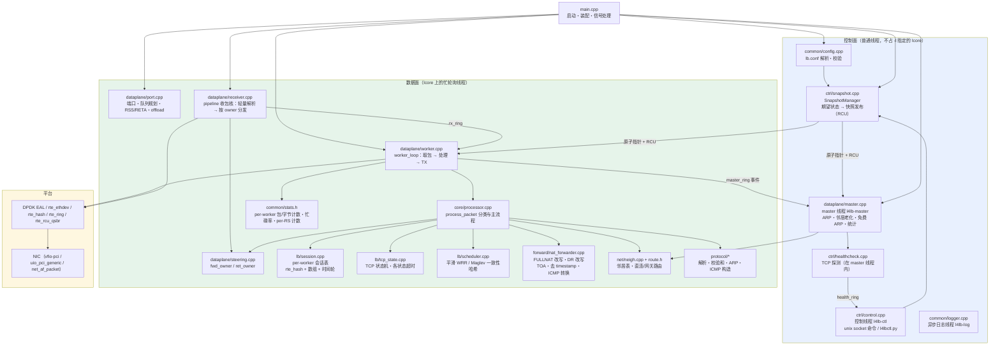
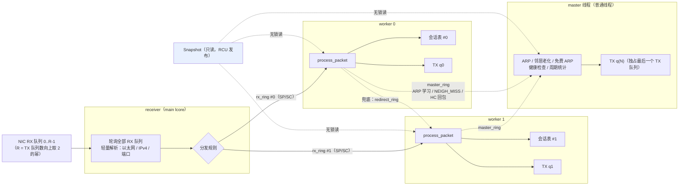
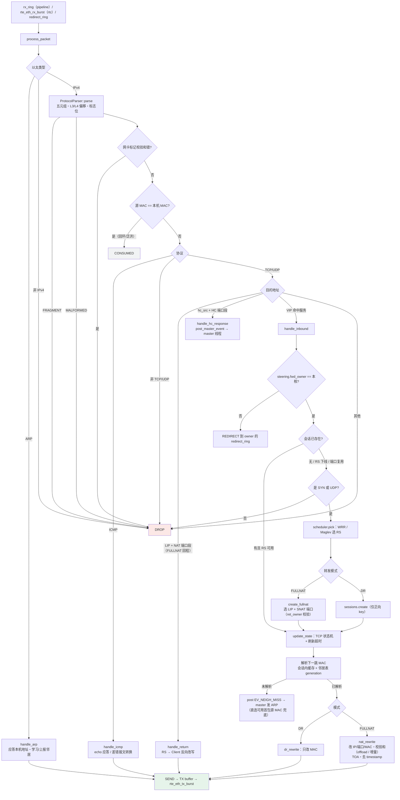
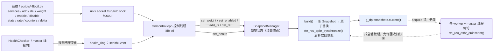
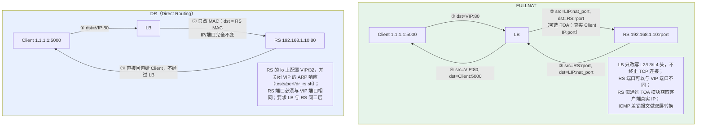
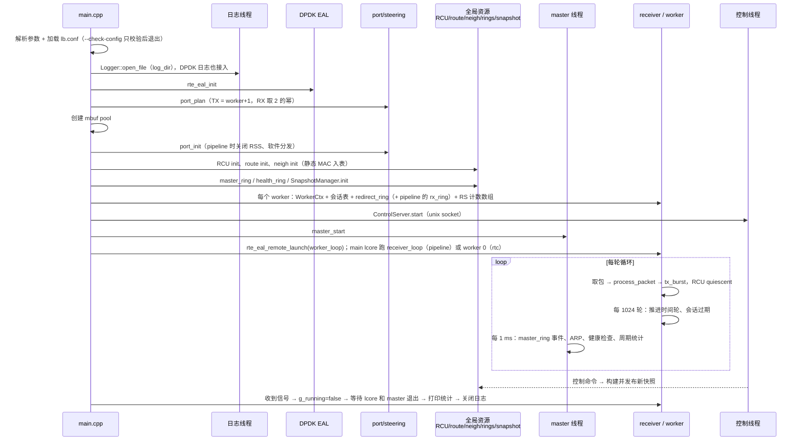

# L4 Load Balancer 整体框架图

基于代码梳理（`src/`、`include/`）绘制，供参考与二次修改。所有图均为 Mermaid，可在支持 Mermaid 的 Markdown 预览器中直接渲染。

---

## 一、总览：分层与模块

---

## 二、多核模型

两种数据面模式由配置 `[global] dataplane` 选择（`docs/pipeline改造.md`）。两种模式下，所有 worker 运行同一份代码；ARP、健康检查、统计都在 master 线程，不在任何 worker 上。

### 2.1 pipeline（默认配置，适合不支持 RSS 的网卡，如 VMware vmxnet3）

receiver 的分发规则（`src/dataplane/receiver.cpp`）：

| 包 | 送往 |
| :--- | :--- |
| FULLNAT 回程（目的是 LIP、端口在 SNAT 段） | `ret_owner(五元组)` = `nat_port % N` |
| 其他 TCP / UDP（入站、健康检查回包） | `fwd_owner(五元组)` = `jhash % N` |
| ICMP、IP 分片、其他 IP 协议 | `jhash(源 IP, 目的 IP) % N` |
| ARP、非 IPv4、头部不完整 | worker 0 |

receiver 不查会话、不改包、不发包；ring 满时丢包并计入 `drop_rx_ring`。分不准的情况（如 ICMP 差错要按内层五元组找 owner）由 worker 再经 `redirect_ring` 转交一次。

### 2.2 rtc（Run-to-Completion，网卡有 RSS 时）

每个 lcore（含 main lcore）都是 worker，worker i 轮询 `q % N == i` 的 RX 队列，自己完成收包、处理、发包。FULLNAT 选 SNAT 端口时用 `Steering::ret_owner()` 反算 RSS，保证回程包由网卡直接送回创建会话的核（不依赖 `rte_flow`）。网卡没有可用的 RSS 时自动退化为软件分发，落到别的核的包经 `redirect_ring` 转交。

### 2.3 要点

- **会话不共享**：每个 worker 独占自己的会话表，热路径无锁、无原子 RMW、无 malloc。
- **队列规划**（`port_plan()`）：TX 队列数 = worker 数 + 1（最后一个给 master 线程）；RX 队列数 = TX 队列数向上取 2 的幂（vmxnet3 要求），不超过网卡上限。
- **FULLNAT 端口分配**：`port_step` 让端口按核错开，避免多核对同一 LIP 端口段竞争。
- **计数**：每个线程只写自己那份计数器（relaxed load + store），读取方跨核汇总；忙碌率只累计处理到包的轮次花掉的 TSC 周期。

---

## 三、包处理主流程（`core/processor.cpp`）

转发成功时累加包数、字节数和会话所属 RS 的计数（`count_fwd_in` / `count_fwd_out`）。

---

## 四、控制面：配置快照与健康检查

健康检查：master 线程用 `hc_src` + 专用端口段发 TCP SYN 探测；RS 的回包由某个 worker 识别后经 `master_ring` 交给 master 判定；状态变化通过 `health_ring` 交给控制线程写入快照并发布。

RCU 读者：各 worker（thread id = lcore id）和 master 线程（`kMasterRcuId`）。pipeline 的 receiver 不读快照，不是读者。命令说明见 `docs/控制命令.md`。

---

## 五、两种转发模式的报文改写

---

## 六、启动与运行时序

---

## 七、目录到职责速查

| 目录 | 职责 | 关键文件 |
| :--- | :--- | :--- |
| `src/` · `common/` | 配置、日志、统计、公共类型、ring 封装 | `config.cpp` `stats.cpp` `logger.cpp` `dpdk_ring.c` |
| `src/` · `protocol/` | 协议头、解析、校验和、ARP/ICMP 报文构造 | `parser.cpp` `checksum.cpp` `arp.cpp` `icmp.cpp` |
| `src/` · `lb/` | 会话表、TCP 状态机、调度器 | `session.cpp` `tcp_state.cpp` `scheduler.cpp` |
| `src/` · `forward/` | FULLNAT/DR 改写、TOA、ICMP 差错转换 | `nat_forwarder.cpp` |
| `src/` · `net/` | 邻居表（ARP 解析/老化）、路由 | `neigh.cpp` `include/net/route.h` |
| `src/` · `ctrl/` | 快照、健康检查、控制命令 | `snapshot.cpp` `healthcheck.cpp` `control.cpp` |
| `src/` · `dataplane/` | 端口初始化、多核分发、receiver / worker / master 线程、统计输出 | `port.cpp` `steering.cpp` `receiver.cpp` `worker.cpp` `master.cpp` `context.cpp` |
| `src/` · `core/` | 报文分类与处理主流程 | `processor.cpp` |
| `scripts/` | 网卡接管、控制命令客户端 | `setup_dpdk_env.sh` `l4lbctl.py` |
| `tests/unit` · `functional` · `perf` | 单元测试 / veth 功能测试 / 压测脚本 | `run_tests.py` `run_bench.sh` `tune.sh` `dr_rs.sh` |
