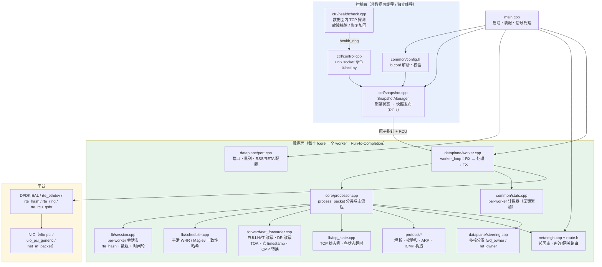
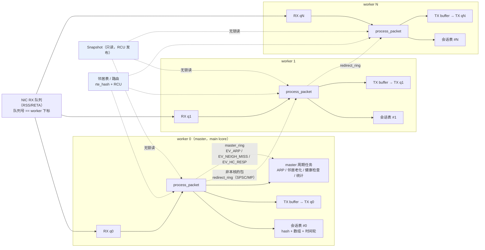
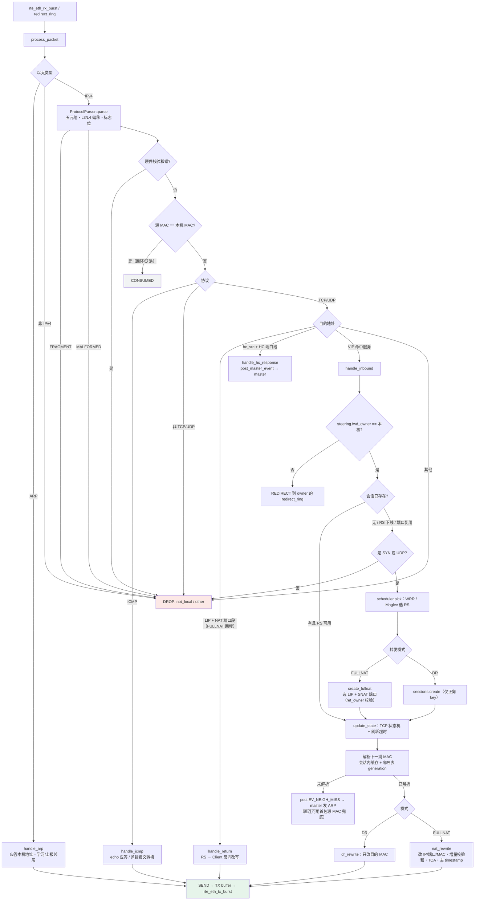
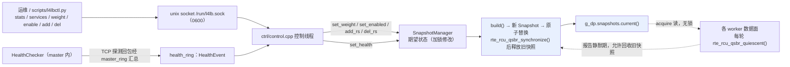
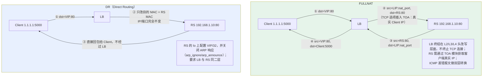
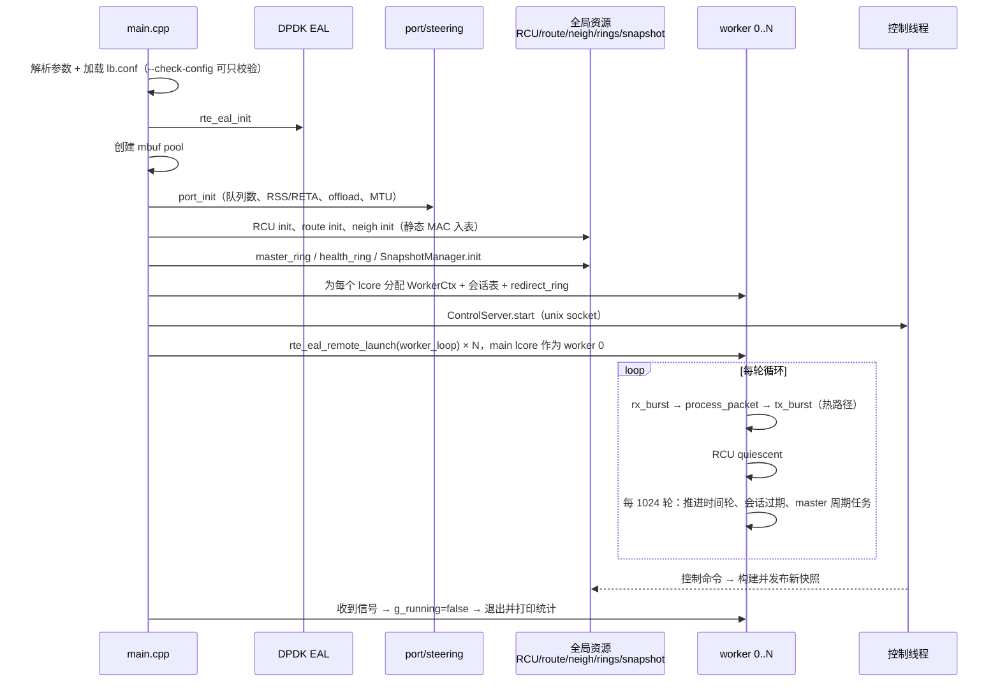

# L4 Load Balancer 整体框架图

基于代码梳理（`src/`、`include/`）绘制，供参考与二次修改。所有图均为 Mermaid，可在支持 Mermaid 的 Markdown 预览器中直接渲染。

---

## 一、总览：分层与模块

---

## 二、多核模型：无锁 per-worker 与分发

要点：

- **会话不共享**：每个 worker 独占自己的会话表，热路径无锁、无原子 RMW、无 malloc。
- **回程定位**：FULLNAT 选 SNAT 端口时用 `Steering::ret_owner()` 反算 RSS，保证回程包仍落到创建会话的核（不依赖 `rte_flow`，vmxnet3 可用）。
- **无 RSS 的网卡**：`init_sw()` 走 jhash 软件分发，落到别的核的包经 `redirect_ring` 转交（只转交一次）。
- **FULLNAT 端口分配**：`port_step` 让端口按核错开，避免多核对同一 LIP 端口段竞争。

---

## 三、包处理主流程（`core/processor.cpp`）

---

## 四、控制面：配置快照与健康检查

健康检查在**数据面内**完成：master 用 `hc_src` + 专用端口段发 TCP 探测，回包由任意 worker 识别后经 `master_ring` 回传给 master 判定，结果通过 `health_ring` 交给控制线程写入快照。

---

## 五、两种转发模式的报文改写

---

## 六、启动与运行时序

---

## 七、目录到职责速查

| 目录 | 职责 | 关键文件 |
| :--- | :--- | :--- |
| `src/` · `common/` | 配置、日志、统计、公共类型、ring 封装 | `config.cpp` `stats.cpp` `logger.cpp` `dpdk_ring.c` |
| `src/` · `protocol/` | 协议头、解析、校验和、ARP/ICMP 报文构造 | `parser.cpp` `checksum.cpp` `arp.cpp` `icmp.cpp` |
| `src/` · `lb/` | 会话表、TCP 状态机、调度器 | `session.cpp` `tcp_state.cpp` `scheduler.cpp` |
| `src/` · `forward/` | FULLNAT/DR 改写、TOA、ICMP 差错转换 | `nat_forwarder.cpp` |
| `src/` · `net/` | 邻居表（ARP 解析/老化）、路由 | `neigh.cpp` `include/net/route.h` |
| `src/` · `ctrl/` | 快照、健康检查、控制命令 | `snapshot.cpp` `healthcheck.cpp` `control.cpp` |
| `src/` · `dataplane/` | 端口初始化、多核分发、worker 循环 | `port.cpp` `steering.cpp` `worker.cpp` `context.cpp` |
| `src/` · `core/` | 报文分类与处理主流程 | `processor.cpp` |
| `tests/unit` · `functional` · `perf` | 单元测试 / veth 功能测试 / 性能测试 | — |
